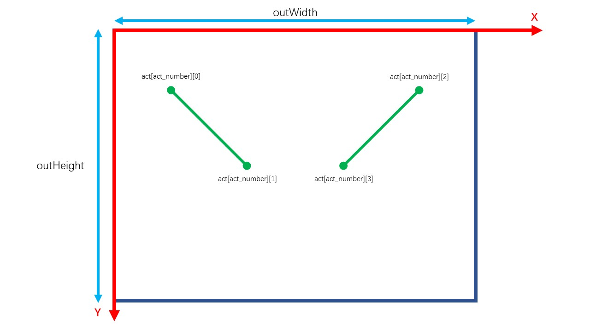
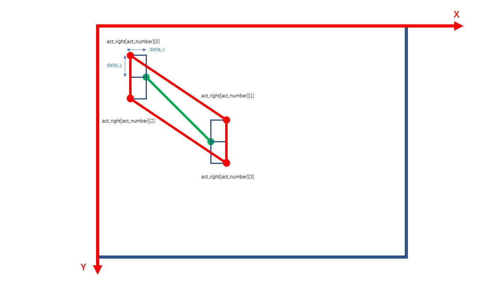
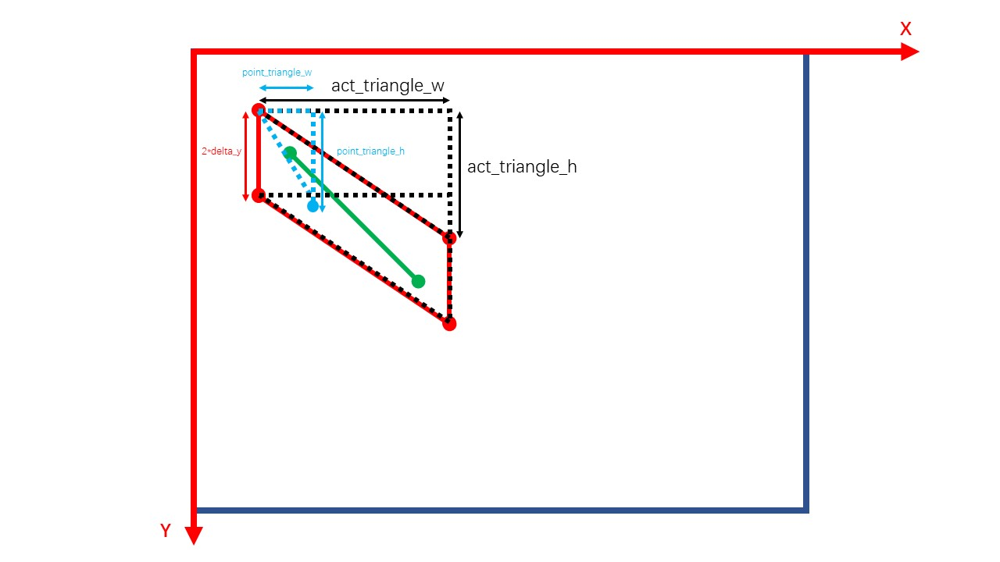

# 人体姿态识别与判定

## 1.功能
识别用户一系列姿态并判定是否符合预设姿态.

## 2.程序详解

### 2.1 参数
```
inWidth = 200  # 画面宽度
inHeight = 200  # 画面高度
thr = 0.05  # 阈值
```
此为后续图像识别算法进行运算的画面像素参数.数值越小,性能要求越小,计算越快,准确度越低.阈值为人体姿态识别算法的阈值.

```
outWidth = 640  # 显示画面宽度
outHeight = 480  # 显示画面高度
```
此处为显示画面参数.

```
delta_x = 10  # 阈值
delta_y = 30
```
此处为判定算法的阈值.改变此参数可以调整以何种精度判定用户动作符合标准.见2.2

### 2.2 动作坐标
```
act = [[(100, 100), (250, 250),  # 右上 右下
        (600, 100), (450, 250)],  # 左上 左下
       # 添加其他动作坐标
       ]
```
act中记录了用户设定的一系列动作,一个动作为一个列表,列表中记录了标准动作的点坐标.

基于act与判定算法的阈值,生成判定平行四边形act_triangle(图中仅显示右侧,下同):
```
for acts in act:
    act_right.append([(acts[0][0] - delta_x, acts[0][1] - delta_y),
                      (acts[1][0] + delta_x, acts[1][1] - delta_y),  # 右侧(画面左侧)上界两点
                      (acts[0][0] - delta_x, acts[0][1] + delta_y),
                      (acts[1][0] + delta_x, acts[1][1] + delta_y)])  # 右侧(画面左侧)下界两点

    act_left.append([(acts[2][0] + delta_x, acts[2][1] - delta_y),
                     (acts[3][0] - delta_x, acts[3][1] - delta_y),  # 左侧(画面右侧)上界两点
                     (acts[2][0] + delta_x, acts[2][1] + delta_y),
                     (acts[3][0] - delta_x, acts[3][1] + delta_y)])  # 左侧(画面右侧)下界两点
```


### 2.3 姿态判定函数detect_point()
以右侧为例:
采用相似三角形判定点是否在平行四边形内,如图:

#### 2.3.1 左右界判定
当横坐标point[0]在act_right[act_number][0]-delta_x与act_right[act_number][1]+delta_x之间,则在左右界内.
#### 2.3.2 上下界判定
计算动作三角形直角边长:
```
act_triangle_w = act_left[act_number][a][0] - act_left[act_number][b][0]
act_triangle_h = act_left[act_number][a][1] - act_left[act_number][b][1]
```
计算关键点三角形直角边长:
```
point_triangle_w = point[0] - act_left[act_number][b][0]
point_triangle_h = point[1] - act_left[act_number][b][1]
```
当point_triangle_h >= (point_triangle_w / act_triangle_w) * act_triangle_h时,点位于上界内

当point_triangle_h >= (point_triangle_w / act_triangle_w) * act_triangle_h + 2*delta_y时,点位于下界内

函数返回值为detect_result(界内为1,界外为0)

### 2.4 连续动作检测
此处设置的关键点为左右肩膀,即points[5]与points[2],调用detect_point()检测点是否在阈值允许的范围内,若在则显示绿色方框并进入下一个动作.
```
while cv.waitKey(1) < 0:
......
    if act_number <= len(act) - 1:
        if points[2] and points[5]:
            detect_right = detect_point(points[2], "right", act_number)
            detect_left = detect_point(points[5], "left", act_number)
            if detect_left and detect_right:
                cv.rectangle(frame, (0, 0), (640, 480), (0, 255, 0), thickness=15)
                act_number += 1
            if act_number == len(act):
                print("Finish!")
                break
```
